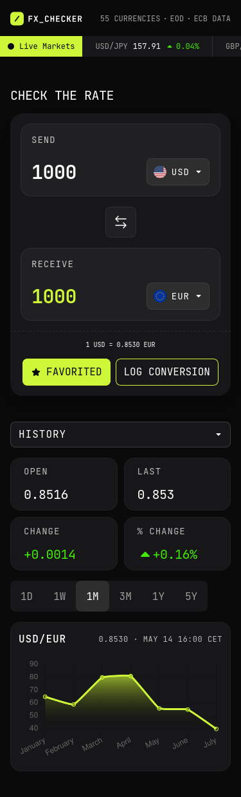
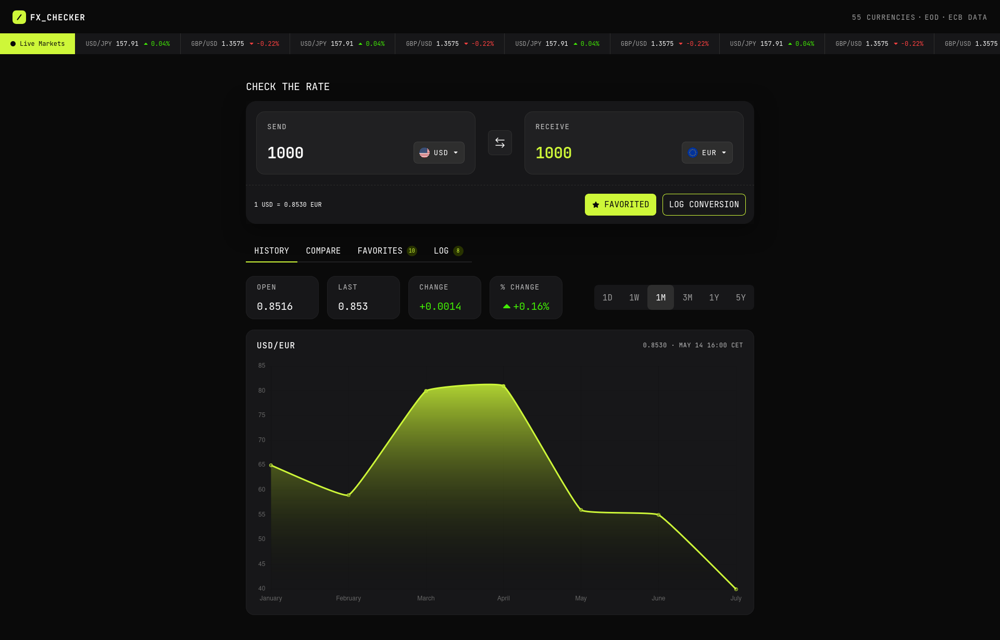

# Frontend Mentor - FX Checker solution

This is a solution to the [FX Checker challenge on Frontend Mentor](https://www.frontendmentor.io/challenges/foreign-exchange-currency-converter). Frontend Mentor challenges help you improve your coding skills by building realistic projects.

## Table of contents

- [Overview](#overview)
  - [The challenge](#the-challenge)
  - [Screenshots](#screenshots)
  - [Links](#links)
- [My process](#my-process)
  - [Built with](#built-with)
  - [What I learned](#what-i-learned)
  - [Continued development](#continued-development)
  - [Useful resources](#useful-resources)
  - [AI Collaboration](#ai-collaboration)
- [Author](#author)
- [Acknowledgments](#acknowledgments)
- [Daily summaries](#daily-summaries)

## Overview

### The challenge

Your users should be able to:

#### Converter

- Enter an amount to send and see it convert in real time as they type
- Pick the "send" and "receive" currencies from a searchable currency picker
- See the live exchange rate for the active pair (for example, `1 USD = 0.8530 EUR`)
- Swap the send and receive currencies with the swap button
- Favorite the active pair, and log a conversion to their history

#### Currency picker

- Search the full list of available currencies by code or name
- See currencies grouped into "Popular" and "Other currencies", each row showing the flag, code, and name
- See a check against the currency that's currently selected

#### Live markets ticker

- See a ticker of currency pairs, each with its current rate and 24-hour change (up or down)

#### Rate history

- View a line and area chart of the active pair's rate over time
- Switch the chart range between 1D, 1W, 1M, 3M, 1Y, and 5Y
- See the open, last, absolute change, and percentage change for the selected range

#### Compare

- See their send amount converted into a range of other currencies at once, each with its reference rate
- Pin or unpin any comparison row to their favorites

#### Favorites

- See their pinned pairs, each with its live rate and 24-hour change
- Load a pinned pair back into the converter by selecting its row
- Unpin a pair they no longer want to track

#### Conversion log

- See a log of conversions they've made, each showing the relative time, the pair, and the send and receive amounts
- Clear the whole log
- Delete an individual entry

#### UI & accessibility

- View the optimal layout for the interface depending on their device's screen size
- See hover and focus states for all interactive elements on the page
- Navigate the entire app using only their keyboard

### Screenshots

### Links

- URL: [https://florianstancioiu.github.io/foreign-exchange-checker/](https://florianstancioiu.github.io/foreign-exchange-checker/)

## My process

### Built with

- Semantic HTML5 markup
- Flexbox
- CSS Grid
- Mobile-first workflow
- [React](https://reactjs.org/) - JS library
- [TypeScript](https://www.typescriptlang.org/) - JavaScript with types
- [TailwindCSS](https://tailwindcss.com/) - For styles
- [Vite](https://vite.dev/) - Build tool

### What I learned

### Continued development

### Useful resources

- [Chart.js - add gradient instead of solid color - implementing solution](https://stackoverflow.com/a/30101977/12159189) - ~~This helped me create a gradient line chart~~ I used a different method to create the gradient, it uses the chart height to set the gradient end position
- [ Linear Gradient](https://www.chartjs.org/docs/latest/samples/advanced/linear-gradient.html) - This is what I used to generate the linearGradient effect on backgroundColor
- [popover HTML global attribute](https://developer.mozilla.org/en-US/docs/Web/HTML/Reference/Global_attributes/popover) - This helped me create a dropdown modal without writing any JS, only JSX
- [position-anchor CSS property](https://developer.mozilla.org/en-US/docs/Web/CSS/Reference/Properties/position-anchor) - This helped me position the dropdown modal with CSS (it's not perfect but it will do for now)
- [How The New POSITIONS Will Work in MODERN CSS - the youtube comment](https://www.youtube.com/watch?v=dsD9bE_QVAs&lc=UgwlktrURgI6jp9LmN14AaABAg) - This helped me position correctly multiple dropdown elements in the same page
- [React Router not working with Github Pages - the second solution worked](https://stackoverflow.com/a/71985764/12159189) - This helped me make shareable link work correctly with Github Actions and React Router
- [scrollbar-width](https://tailwindcss.com/docs/scrollbar-width) - This helped me remove the vertical scrollbar in Chromium based browsers
- [react-flags](https://www.npmjs.com/package/react-flags) - This package helped me add most of the SVG flags (I actually had to remove 10 currencies because the package didn't provide svg icons for them), I had copy the svg icons from the package over to my repo, the package has a MIT license so I think I'm good on that.
- [React Smart Ticker](https://github.com/eugen-k/react-smart-ticker) - This helped me add the functionality of a ticker to the Header component
- [Manipulating the DOM with Refs](https://react.dev/learn/manipulating-the-dom-with-refs) - This aided me in my task of hiding the currency picker popover element

### AI Collaboration

I didn't explicitly use any kind of AI tool during the development of this solution.

## Author

- Frontend Mentor - [@florianstancioiu](https://www.frontendmentor.io/profile/florianstancioiu)
- Threads - [@florianstancioiu01](https://www.threads.com/@florianstancioiu01)
- LinkedIn - [florianstancioiu](https://www.linkedin.com/in/florian-stancioiu-765661349/)
- freeCodeCamp - [florianstancioiu](https://www.freecodecamp.org/florianstancioiu)

## Acknowledgments

**Will update or delete this section in the future**

## Daily summaries

| Date            | Time Spent | Summary                                                                                                   |
| --------------- | ---------- | --------------------------------------------------------------------------------------------------------- |
| June 12th, 2026 | 1.5 hours  | I created the boilerplate for the project and the base components                                         |
| June 13th, 2026 | 2 hours    | I worked on the mobile Header and CheckRate components                                                    |
| June 14th, 2026 | 3 hours    | I finished the mobile version for History and Compare pages                                               |
| June 16th, 2026 | 2 hours    | I worked on the Favorite and LogItem components, I also created the base component for LineChart          |
| June 17th, 2026 | 1 hour     | I worked on the tablet version of the History page                                                        |
| June 19th, 2026 | 4 hours    | I worked on the tablet and desktop version of the pages                                                   |
| June 20th, 2026 | 2 hours    | I worked on the CurrencyPicker component, converted CTAs to button elements, handled focus-visible states |
| June 21st, 2026 | 4 hours    | I adjusted the app for extra small devices & started to experiment with frankfurter API                   |
| June 23rd, 2026 | 4 hours    | I worked on the LiveMarkets ticker and on the History page (homepage) functionality                       |
| June 24th, 2026 | 1 hour     | I worked on the CheckRate component                                                                       |

_Total time spent working on the project:_ **24.5 hours**
